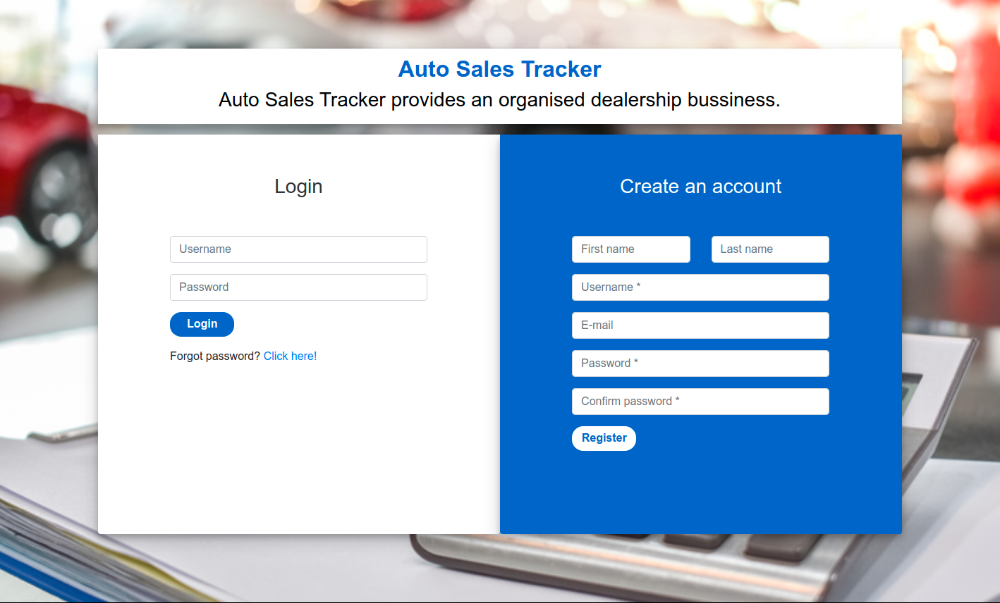
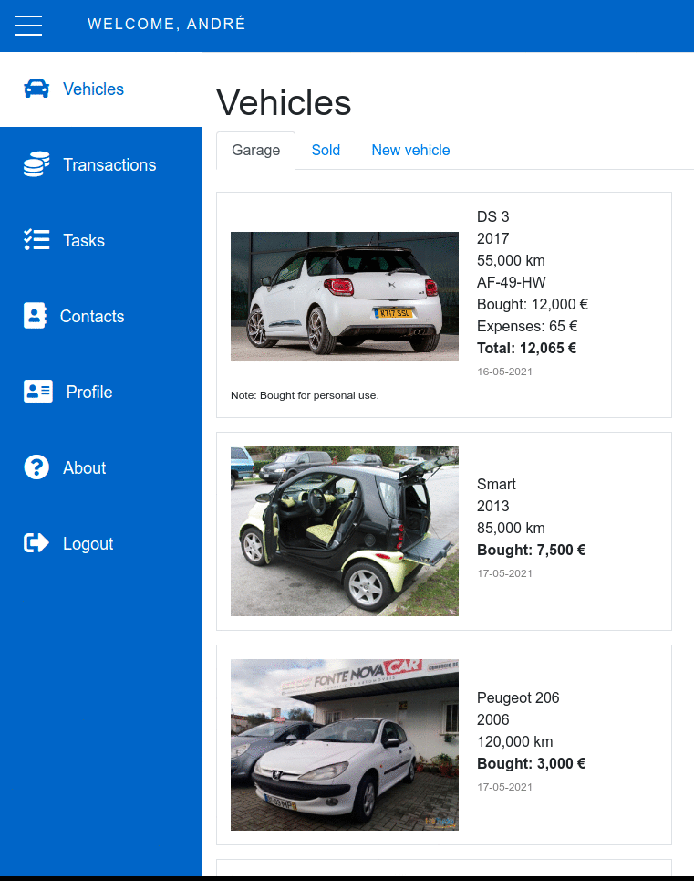

# Auto Sales Tracker

Auto Sales Tracker is a web application that acts as a tool to track a car dealership business. Users are able to register, submit their vehicles, contacts, expenses, and tasks in order to better organize their business.

As the user adds tasks, these are able to be associated with vehicles and/or contacts. Transactions can be saved as expenses, services provided, purchases or selling of vehicles. Vehicles will track their tasks and expenses and calculate possible profits upon selling.

The web app utilizes Django with 7 models (Users, Vehicle, Contact, Transaction, Task, CarMake and CarModel) on the back-end and JavaScript on the front-end.

## Motivation
This project was developed as the final project for Harvard's [CS50's Web Programming with Python and Javascript](https://www.edx.org/course/cs50s-web-programming-with-python-and-javascript). This was also an attempt to simplify my father's small dealership business where tracking all expenses or tasks related to a specific vehicle or contact can get complicated.

#### Complexity
This project provided a greater challenge than the previous projects for the following reasons:
- It is a unique web app for a real life problem;
- Contains a complex relationship between the created models - transactions/vehicles can be related to contacts, vehicles are related to car makes and models, tasks can be related to either vehicles or contacts, etc...;
- Content is shown with ajax functionality - with no need to reload the page;
- User can change their details, password, or even recover password;
- Users can create/delete contacts, create/delete tasks or mark as done, create vehicles, mark them as sold and finally add expenses/services provided with transactions.
- By inputting the car make, model and year, a Google image search is done and an image is automatically added to display in the garage view;
- The web app is mobile responsive with different displays for different resolutions;
- The JavaScript files needed to output all the relevant information on the front-end through API's required a greater effort.

## Installation
Install the project dependencies by running:
```console
pip install -r requirements.txt
```
Alternatively:
```console
pip install 'Django==3.2'
pip install 'requests==2.22.0'
pip install 'beautifulsoup4==4.9.3'
```
Make and apply all migrations:
```console
python manage.py makemigrations
python manage.py migrate
```
Finally:
```console
python manage.py runserver
```
By going to [http://127.0.0.1:8000/](http://127.0.0.1:8000/) the login page should be visible:



You can now create an account and use the web app.

## Project structure

The project follows the structure:

- `autosales` - Directory with settings and urls;
    - `urls.py` - File contains urls for admin as "/admin/" for the finance app "/" and for account management "/accounts/" (used for password recovery);
- `finance` - Main app with all the main functionalities;
    - `static/finance` - All the static files used;
        - `garage.png` - Image of a garage;
        - `index.css` - CSS file with all index.html page settings;
        - `index.js` - JavaScript file runs with the index.html page;
        - `login-background.png` - Background image for the login.html page;
        - `login.css` - CSS file with all the login.html page settings;
        - `login.js` - JavaScript file runs with the login.html page;
        - `sidebar.css` - CSS file exclusively for the sidebar in the main page index.html;
    - `templates/finance` - All the templates used;
        - `index.html` - Main page where the user can see all the features provided
        - `layout.html` - Common layout between the login and index pages;
        - `login.html` - Login page where the user can either create an account or login;
    - `admin.py` - Admin file with the registration of all the used models
    - `models.py` - Models file with the models used - User, Contact, CarMake, CarModel, Vehicle, Transaction and Task;
    - `urls.py` - Urls with the navigation between the index.html and login.html as well as the API routes which edits, adds or loads content;
    - `views.py` - File with all the application views regarding the loading of pages and API routes;
    - `requirements.txt` - File with all the required dependencies to run the project;
    - `.gitignore` - Git ignore with all the unnecessary files and directories.

### Views


